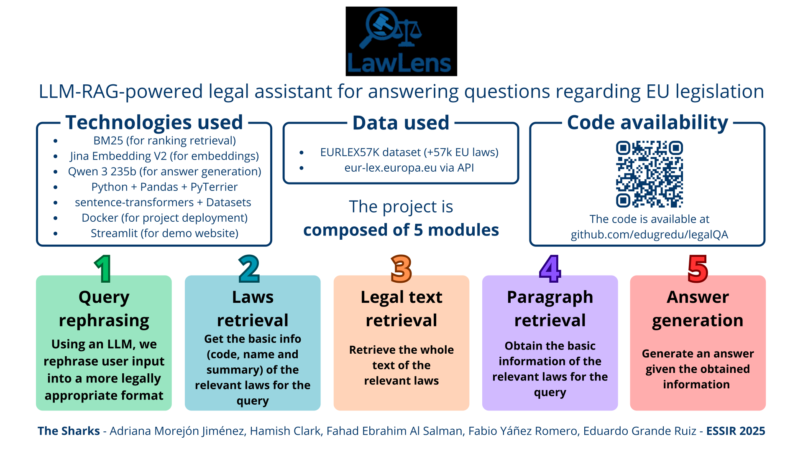

# LawLens: LLM-RAG-powered Legal Assistant for EU Legislation

- **Team:** The Sharks
- **Event:** ELLIS ESSIR 2025 Hackathon
- **Location:** University of Wolverhampton, UK




## 🎯 Overview

LawLens is an intelligent legal assistant designed to answer questions regarding EU legislation using advanced Information Retrieval (IR) and Retrieval-Augmented Generation (RAG) techniques. The system leverages Large Language Models to provide accurate, legally-appropriate responses to user queries about European Union laws.

## 👥 Team Members

- **Adriana Morejón Jiménez** (University of Alicante, Spain)
- **Hamish Clark** (University of Glasgow, UK)
- **Fahad Ebrahim Al Salman** (University of Warwick, UK)
- **Fabio Yáñez Romero** (University of Alicante, Spain)
- **Eduardo Grande Ruiz** (University of Alicante, Spain)


## 🏗️ System Architecture

The LawLens system consists of **5 interconnected modules**:

1. **Query Rephrasing** - Uses an LLM to rephrase user input into a more legally appropriate format
2. **Laws Retrieval** - Gets the basic info (code, name and summary) of the relevant laws for the query
3. **Legal Text Retrieval** - Retrieves the whole text of the relevant laws
4. **Paragraph Retrieval** - Obtains the basic information of the relevant laws for the query
5. **Answer Generation** - Generates an answer given the obtained information

## 🛠️ Technologies Used

### Core ML/AI Components

- [**BM25**](https://pyterrier.readthedocs.io/en/latest/terrier-retrieval.html) - For ranking retrieval.
- [**Jina Embedding V2**](https://huggingface.co/jinaai/jina-embeddings-v2-base-zh) - For embeddings.
- **[Qwen 3 235b](https://openrouter.ai/qwen/qwen3-235b-a22b:free)** - For answer generation via OpenRouter API.


### Development Stack

- **Python** - Main programming language
- **Pandas** - Data manipulation and analysis
- **PyTerrier** - Information retrieval framework
- **sentence-transformers** - Sentence embedding models
- **Datasets** - Data loading and processing


### Infrastructure \& Deployment

- **Docker** - Project containerization and deployment
- **Streamlit** - Interactive demo website


## 📊 Data Sources

- **[EURLEX57K](https://huggingface.co/datasets/jonathanli/eurlex)** - Over 75.000 EU laws with summaries
- **[EUR-Lex API](https://eur-lex.europa.eu/content/help/data-reuse/webservice.html)** - Direct access to official EU legal documents via `eur-lex.europa.eu`


## 🚀 Getting Started

### Prerequisites

- Python 3.8+
- Docker (for containerized deployment)
- Git


### Installation

1. **Clone the repository:**
```bash
git clone https://github.com/edugredu/legalQA.git
cd legalQA
```

2. **Install dependencies:**
```bash
pip install -r requirements.txt
```

3. **Set up environment variables:**
```bash
cp .env.example .env
# Edit .env with your configuration
```


### Running the Application

#### Local Development

```bash
# Run the Streamlit demo
streamlit run app.py
```


#### Docker Deployment

```bash
# Build and run with Docker
docker build -t legalqa .
docker run -p 8501:8501 legalqa
```


## 💻 Usage

1. **Access the web interface** at `http://localhost:8501`
2. **Enter your legal question** in natural language
3. **Review the system's response** with relevant EU law citations
4. **Explore referenced legal documents** for deeper understanding

### Example Queries

- "What are the GDPR requirements for data processing?"
- "How does EU law regulate artificial intelligence?"
- "What are the penalties for competition law violations?"


## 🔧 Project Structure

```
legalQA/
├── src/
│   ├── module_1.py (Query rephrasing logic)
│   ├── module_2.py (Laws retrieval logic)
│   ├── module_3.py (Legal text retrieval logic)
│   ├── module_4.py (Paragraph retrieval logic)
│   ├── module_5.py (Answer generation logic)
│   ├── prompts/ (LLM prompt templates)
│   │   ├── prompt_1.txt (Query rephrasing prompt)
│   │   └── prompt_5.txt (Answer generation prompt)
│   ├── data/ (cache data files for laws)
│       └── .csv (cached laws data files)
├── .gitignore (ignored files for Git)
├── app.py (Streamlit demo)
├── Dockerfile (for containerization)
├── LICENSE (project license)
├── Makefile (for build automation)
├── orchestrator.py (for managing modules)
├── README.md (this documentation file)
├── requirements.txt (Python dependencies)
└── summary.svg (project summary diagram)
```


## 🎓 About ESSIR 2025

This project was developed as part of the **European Summer School on Information Retrieval (ESSIR) 2025** hackathon[^1]. ESSIR 2025 focuses on cutting-edge IR training, covering topics from Generative AI to RAG, explainability, neural ranking, and more. The event took place at the University of Wolverhampton, UK, and is associated with the ELLIS Unit London.

## 📝 License

This project is licensed under the CC BY-NC 4.0 - see the LICENSE file for details.

## 🤝 Contributing

We welcome contributions to improve LawLens! Please feel free to submit issues, feature requests, or pull requests.

**Developed with ❤️ by Team "The Sharks" at ESSIR 2025**

<div style="text-align: center"></div>

[^1]: https://2025.essir.eu